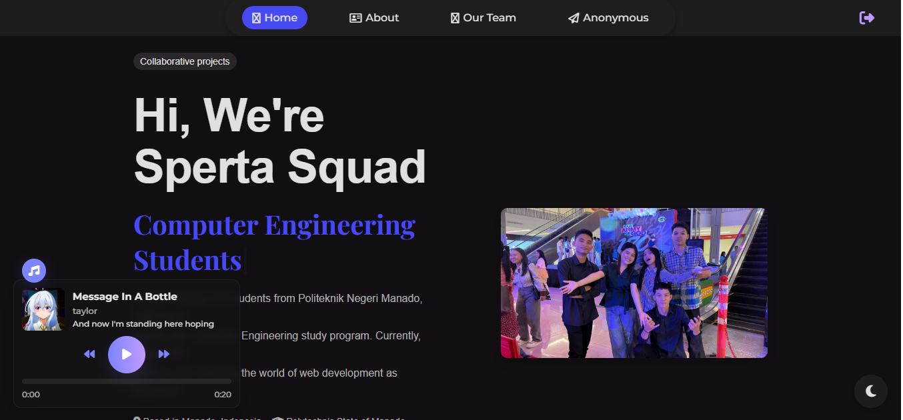

# ⚡ Sperta Squad Official Website

Website profil resmi **Sperta Squad** (Computer Engineering Students - Polimdo).

Website ini dirancang dengan tampilan modern, *fully responsive*, dan dilengkapi berbagai fitur interaktif seperti pemutar musik dengan lirik, galeri tim dinamis, serta fitur pesan anonim yang terintegrasi dengan database realtime.


*(Pastikan kamu punya file screenshot bernama ss.jpg untuk preview di sini)*

## ✨ Fitur Unggulan

- **🎵 Modern Music Player**: Pemutar musik *floating* di pojok kiri bawah dengan tampilan album art, progress bar, dan lirik yang sinkron (*karaoke style*).
- **🕵️ Anonymous Message**: Kirim pesan rahasia/curhatan ke tim menggunakan **Firebase Firestore**.
- **👥 Dynamic Team Loader**: Foto anggota tim dimuat secara otomatis dari folder, tanpa perlu edit HTML manual.
- **🛡️ Admin Dashboard**: Fitur login khusus admin (ikon perisai) untuk menghapus pesan yang tidak pantas.
- **🌓 Dark/Light Mode**: Mendukung pergantian tema gelap/terang yang otomatis tersimpan di browser.
- **⚡ Smooth Animations**: Efek *typing text*, *scroll reveal*, dan *loading screen* yang elegan.
- **📱 Responsif**: Tampilan menyesuaikan otomatis di Desktop, Tablet, dan HP.

## 🚀 Cara Instalasi

### 1. Persiapan File
Pastikan semua file berikut ada dalam satu folder utama:
- `index.html`
- `stayle.css`
- `main.js`
- Folder `images/` dan `music/`

### 2. Konfigurasi Firebase (WAJIB)
Karena file `config.js` berisi kunci rahasia, kamu harus membuatnya sendiri agar fitur **Pesan Anonim** bisa jalan.

1. Buat file baru bernama `config.js` di folder utama.
2. Isi dengan kode konfigurasi dari Firebase Console kamu:

```javascript
// config.js
const firebaseConfig = {
    apiKey: "API_KEY_KAMU",
    authDomain: "project-id.firebaseapp.com",
    projectId: "project-id",
    storageBucket: "project-id.firebasestorage.app",
    messagingSenderId: "SENDER_ID",
    appId: "APP_ID"
};
````

## 🎵 Tutorial Menambah Lagu & Lirik

Sistem ini membaca file musik dari folder `music/` dan lirik dari file `.json` di folder utama.

### Langkah 1: Siapkan File Audio

Masukkan file lagu (format `.mp3`) ke dalam folder `music/`.

  * Contoh: `music/galau.mp3`

### Langkah 2: Daftarkan Lagu di Script

Buka file `main.js`, cari bagian paling atas (`const musicFiles`), dan tambahkan path lagunya:

```javascript
const musicFiles = [
  'music/amelsound.mp3',
  'music/sigma.mp3',
  'music/sperta.mp3',
  'music/galau.mp3' // <-- Tambahkan lagu barumu di sini (pakai koma)
];
```

### Langkah 3: Buat File Lirik (JSON)

Buat file `.json` baru di folder utama (sejajar dengan `index.html`). **Nama file JSON harus sama persis dengan nama file MP3-nya.**

  * Jika lagu: `galau.mp3`
  * Maka JSON: `galau.json`

Isi file JSON dengan format berikut:

```json
{
  "music": {
    "title": "Judul Lagu Kamu",
    "artist": "Nama Penyanyi",
    "albumArt": "images/cover_lagu.jpg", 
    "duration": 180,
    "timeSync": [
      { "time": 0, "text": "Intro musik..." },
      { "time": 5, "text": "Baris lirik pertama muncul di detik ke-5" },
      { "time": 12, "text": "Baris lirik kedua muncul di detik ke-12" },
      { "time": 20, "text": "Gunakan \\n untuk baris baru (enter)" }
    ]
  }
}
```

*(Catatan: `albumArt` opsional, jika tidak diisi akan pakai gambar default `elaina.jpg`)*

## 👥 Tutorial Menambah Anggota Tim

Kamu tidak perlu mengedit HTML untuk menambah foto anggota. Cukup ikuti aturan penamaan file:

1.  Siapkan foto anggota (ratio 1:1 atau portrait lebih bagus).
2.  Simpan di folder `images/`.
3.  Beri nama file secara berurutan: `team1.jpg`, `team2.jpg`, `team3.jpg`, dst.
4.  Script akan otomatis mendeteksi dan menampilkannya di halaman "Our Team".

## 📂 Struktur Folder Project

Agar website berjalan lancar, pastikan struktur foldermu seperti ini:

```text
/ (Folder Utama)
├── index.html          # File halaman utama
├── stayle.css          # File desain (CSS)
├── main.js             # Logika website (Player, Tim, Firebase)
├── config.js           # Konfigurasi Firebase (Buat file ini!)
├── Readme.md           # Dokumentasi ini
├── galau.json          # Contoh file lirik (sesuai nama mp3)
├── images/             # Folder gambar
│   ├── logo.png
│   ├── elaina.jpg      # Default album art
│   ├── team1.jpg       # Foto tim (berurutan)
│   └── team2.jpg
└── music/              # Folder lagu
    ├── sigma.mp3
    └── galau.mp3
```

## 🛡️ Panduan Admin

Untuk menghapus pesan spam/kasar di kolom Anonymous:

1.  Klik ikon **Perisai** (\<i class="fa-solid fa-user-shield"\>\</i\>) di header kanan atas.
2.  Login dengan akun Google Admin.
3.  Klik tombol **Sampah** pada pesan yang ingin dihapus.

-----

### ❤️ Credits

**Created with ❤️ by Sperta Squad**
*Politeknik Negeri Manado*

Feel free to modify and learn\!

```
